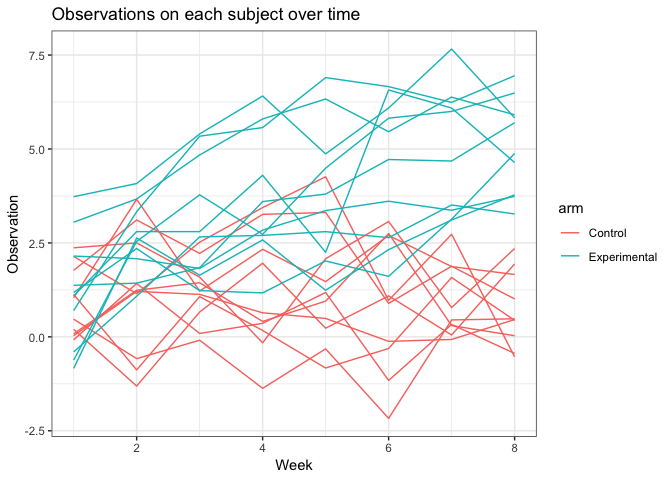
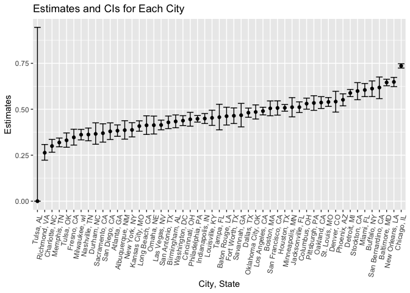

P8105 Homework 5
================
Apoorva Srinivasan
11/03/2018

PROBLEM 1
---------

*Importing data and separating the groups:*

*Tidying the data: the code chunk below tidies the given data and creates new columns arm and study id.*

``` r
p1_tidy = p1_df %>%
  bind_rows() %>%
  gather(key = week, value = observation, week_1:week_8) %>%
  separate(week, into = c("delete", "week"), sep = "_") %>%
  select(study_id, arm, everything(), -(delete)) %>%
  arrange(study_id, week) %>%
  mutate(week = as.integer(week), 
         study_id = as.character(study_id))

p1_tidy
```

    ## # A tibble: 160 x 4
    ##    study_id arm           week observation
    ##    <chr>    <chr>        <int>       <dbl>
    ##  1 1        Control          1        0.2 
    ##  2 1        Experimental     1        3.05
    ##  3 1        Control          2       -1.31
    ##  4 1        Experimental     2        3.67
    ##  5 1        Control          3        0.66
    ##  6 1        Experimental     3        4.84
    ##  7 1        Control          4        1.96
    ##  8 1        Experimental     4        5.8 
    ##  9 1        Control          5        0.23
    ## 10 1        Experimental     5        6.33
    ## # ... with 150 more rows

*Spaghetti plot of observations on each subject over time.*

``` r
p1_tidy %>%
  group_by(arm, study_id) %>% 
  ggplot(aes(x = week, y = observation, color = arm, type = study_id)) + 
    geom_line() +
  labs(title = "Observations on each subject over time",
       x = "Week", 
       y = "Observation") +
  theme_bw()
```



**Comment:** From the plot above, we notice that although the observations for both control and experimental group are similar for the first couple of weeks, observations in experimental groups increases over time while the other does not.

PROBLEM 2
---------

*Inporting data*

``` r
homicide = read_csv("./homicide-data.csv")
```

We're given a data collected by The Washington Post on homicides in 50 large US cities. This dataset contains 52179 people with 12 variables including date, victim names, race, age, sex, location and dispostion.

``` r
homicide = homicide %>%
   mutate(city_state = str_c(city, ", ", state),
         disposition = as.factor(disposition)) 
```

*Summarizing within cities to obtain the total number of homicides and the number of unsolved homicides*

``` r
homicide_group = homicide %>%
  group_by(city_state) %>%
  summarise(n_total = n(),
  n_unsolved = sum(disposition %in% c("Closed without arrest", "Open/No arrest")))
```

*Estimate proportions and confidence intervals for Baltimore, MD*

``` r
homicide_balt = homicide_group %>%
  filter(city_state == "Baltimore, MD") 
  prop.test(homicide_balt$n_unsolved, homicide_balt$n_total) %>%
  broom::tidy() %>%
    select(estimate, conf.low, conf.high) %>% 
  knitr::kable()
```

|   estimate|   conf.low|  conf.high|
|----------:|----------:|----------:|
|  0.6455607|  0.6275625|  0.6631599|

``` r
  homicide_balt
```

    ## # A tibble: 1 x 3
    ##   city_state    n_total n_unsolved
    ##   <chr>           <int>      <int>
    ## 1 Baltimore, MD    2827       1825

*Developing a function and iterating over all cities*

``` r
prop_city = function(x, y){
  
  prop.test(x,y) %>% 
    broom::tidy() %>% ##using broom::tidy to convert into dataframe
  select(estimate, conf.low, conf.high)
  
}

prop_city = map2(.x = homicide_group$n_unsolved, .y = homicide_group$n_total, ~prop_city(.x, .y)) %>% 
  bind_rows() %>% 
  mutate(city_state = homicide_group$city_state) %>% 
  select(city_state, everything()) 
```

    ## Warning in prop.test(x, y): Chi-squared approximation may be incorrect

``` r
prop_city
```

    ## # A tibble: 51 x 4
    ##    city_state      estimate conf.low conf.high
    ##    <chr>              <dbl>    <dbl>     <dbl>
    ##  1 Albuquerque, NM    0.386    0.337     0.438
    ##  2 Atlanta, GA        0.383    0.353     0.415
    ##  3 Baltimore, MD      0.646    0.628     0.663
    ##  4 Baton Rouge, LA    0.462    0.414     0.511
    ##  5 Birmingham, AL     0.434    0.399     0.469
    ##  6 Boston, MA         0.505    0.465     0.545
    ##  7 Buffalo, NY        0.612    0.569     0.654
    ##  8 Charlotte, NC      0.300    0.266     0.336
    ##  9 Chicago, IL        0.736    0.724     0.747
    ## 10 Cincinnati, OH     0.445    0.408     0.483
    ## # ... with 41 more rows

*Plot that shows the estimates and CIs for each city*

``` r
prop_city %>% 
  ggplot(aes(x = fct_reorder(city_state, estimate), y = estimate)) +
  geom_point() +
  geom_errorbar(aes(ymin = conf.low, ymax = conf.high)) +
  theme(axis.text.x = element_text(angle = 80, hjust = 1))+
  labs(
    title = "Estimates and CIs for Each City",
    x = "City, State",
    y = "Estimates" )
```


